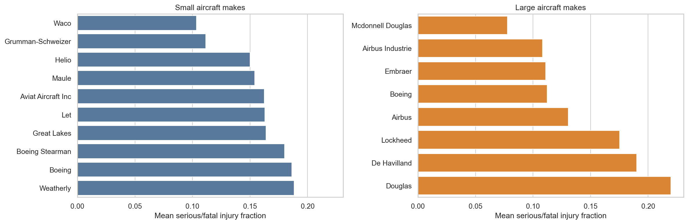
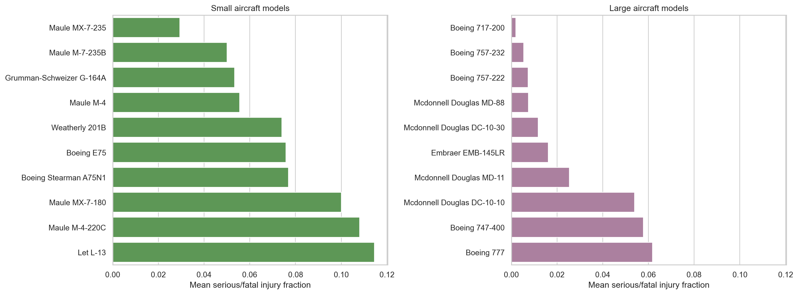
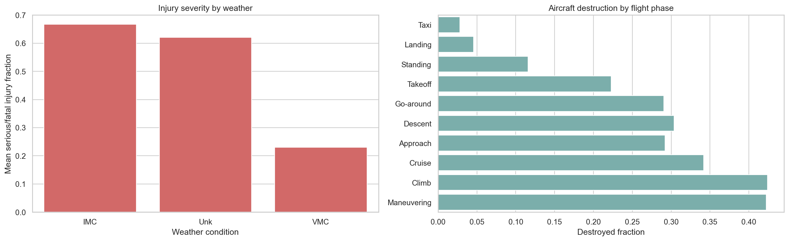

# Aviation Accident Analysis

This project analyzes aviation accident records from the NTSB dataset to identify aircraft makes and models with lower observed accident severity. The client focus is professional-built aircraft that could plausibly still be active, so the analysis filters to accidents from 1983 onward and excludes amateur-built aircraft.

The main safety metrics are:

- **Serious/fatal injury fraction**: `(fatal injuries + serious injuries) / estimated people onboard`
- **Destroyed fraction**: share of accident records where `Aircraft.damage` is `Destroyed`
- **Sample thresholds**: makes require at least 20 accidents within the small or large segment; specific make/model airplane types require at least 10 accidents

Small airplanes are defined as aircraft with **20 or fewer estimated people onboard**. Large airplanes are defined as aircraft with **more than 20 estimated people onboard**.

## Key Recommendations

### Small Airplanes

Recommended small-aircraft makes include **Waco**, **Maule**, **Aviat Aircraft Inc**, **Let**, and **Boeing Stearman**. These makes showed comparatively low mean serious/fatal injury fractions among small-aircraft accident records while also maintaining reasonable sample sizes.

Recommended small-aircraft make/model candidates include:

- **Maule MX-7-235**
- **Maule M-7-235B**
- **Grumman-Schweizer G-164A**
- **Maule M-4**
- **Weatherly 201B**

### Large Airplanes

Recommended large-aircraft makes include **McDonnell Douglas**, **Airbus Industrie**, **Embraer**, **Boeing**, and **Airbus**. Among these, McDonnell Douglas had the lowest mean serious/fatal injury fraction in the filtered large-aircraft group, while Embraer had the lowest observed destruction rate among the qualifying large-aircraft makes.

Recommended large-aircraft make/model candidates include:

- **Boeing 717-200**
- **Boeing 757-232**
- **Boeing 757-222**
- **McDonnell Douglas MD-88**
- **McDonnell Douglas DC-10-30**
- **Embraer EMB-145LR**

These recommendations are based on accident severity conditional on an accident being recorded. The dataset does not include total departures, aircraft in service, or flight hours, so this analysis does not estimate accident frequency.

## Key Visualizations

### Serious/Fatal Injury Rates by Make

### Serious/Fatal Injury Rates by Model

### Factors Affecting Injury and Damage Outcomes

## Factor Analysis Summary

At least two non-model factors appear related to injury and damage outcomes:

- **Weather condition**: IMC accidents had much higher observed serious/fatal injury fractions and aircraft destruction rates than VMC accidents. This suggests lower-visibility or instrument-weather accidents are more severe when they occur.
- **Broad phase of flight**: Taxi and landing accidents had the lowest observed severity, while climb, cruise, approach, and maneuvering accidents showed substantially higher injury and destruction rates. This likely reflects differences in speed, altitude, and recovery options during the accident sequence.
- **Engine type** was also reviewed. Turbo-fan aircraft had lower conditional injury severity than several other high-sample engine groups, but this factor is likely confounded with aircraft size, route type, and operating environment.

## Repository Contents

- `Aviation_Accidents_Cleaning.ipynb`: data loading, cleaning, filtering, and feature construction
- `Aviation_Accidents_Data_Analysis.ipynb`: exploratory analysis, plots, summary statistics, recommendations, and factor analysis
- `data/AviationData.csv`: source aviation accident data
- `data/USState_Codes.csv`: state abbreviation reference data
- `images/`: README visualizations generated from the analysis
